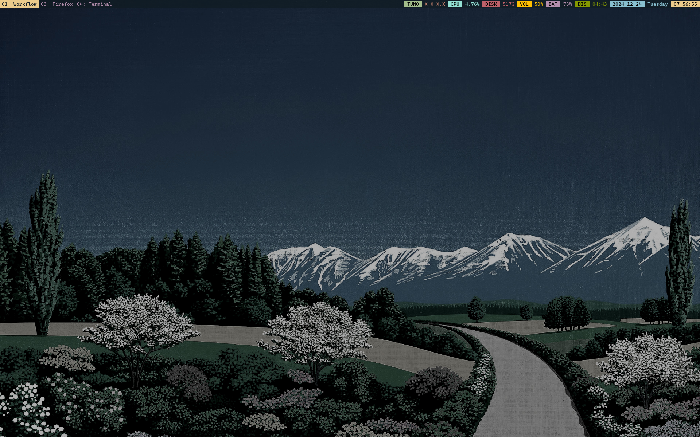

## Install:

```bash
git clone https://github.com/PrettyBoyCosmo/nix.git
cd $HOME/nix
cp /etc/nixos/hardware-configuration nixos/hosts
sudo nixos-rebuild switch --flake .#ccs
home-manager switch --flake .#ccs
```

## Scrots:
#### i3



#### Hyprland

